# Maintainarr

Task automation and metadata-driven grouping for the \*arr ecosystem.

## Quick Start

### Prerequisites

- **Node.js**: v24.13.0 or higher (automatically managed via `.nvmrc`)
- **Package Manager**: Yarn 1.22+
- **OS**: Linux, macOS, or WSL2

### Setup

1. **Install Node Version Manager (fnm)**

   ```bash
   # Install fnm
   curl -fsSL https://fnm.vercel.app/install | bash

   # Restart your shell or run:
   source ~/.bashrc  # or ~/.zshrc

   # fnm will automatically use the Node version from .nvmrc
   ```

2. **Install Dependencies**

   ```bash
   yarn install
   ```

### Development

```bash
# Start dev server (port 5056)
yarn dev

# Run all tests and checks (GOD SCRIPT)
yarn verify          # Full: Lint + TypeCheck + Unit Tests + E2E
yarn verify:fast     # Skip E2E tests (faster)

# Individual commands
yarn lint            # Check code quality
yarn lint:fix        # Fix code quality issues
yarn typecheck       # Type check
yarn test            # Unit tests (watch mode)
yarn test:run        # Unit tests (run once)
yarn test:e2e        # E2E tests (interactive)
yarn ladle           # Component stories
```

## Project Structure

Maintainarr is organized into backend (Express + TypeORM) and frontend (Next.js + React) with comprehensive documentation in every directory.

### High-Level Structure

```mermaid
graph TB
    Root[📦 Maintainarr]

    Root --> Server[🖥️ server/]
    Root --> Src[⚛️ src/]
    Root --> Tests[🧪 tests/]
    Root --> Config[⚙️ config/]

    Server --> ServerDocs["📖 Server Architecture<br/>Express + TypeORM backend"]
    Src --> SrcDocs["📖 Frontend<br/>Next.js + React + Tailwind"]
    Tests --> TestsDocs["📖 Test Infrastructure<br/>Helpers + Mocks + Factories"]
    Config --> ConfigDocs["📖 Runtime Config<br/>Database + Logs"]

    click Server "server/README.md" "Backend architecture and API"
    click Src "src/README.md" "Frontend components and pages"
    click Tests "tests/README.md" "Testing utilities and mocks"
    click Config "config/README.md" "Runtime configuration directory"

    style Server fill:#0d9488,stroke:#0f766e,color:#fff
    style Src fill:#6366f1,stroke:#4f46e5,color:#fff
    style Tests fill:#8b5cf6,stroke:#7c3aed,color:#fff
    style Config fill:#64748b,stroke:#475569,color:#fff
```



### Server Directory (Backend)


### Frontend Directory (Client)

```mermaid
graph TB
    Src[⚛️ src/]

    Src --> Components[components/]
    Src --> Hooks[hooks/]
    Src --> Pages[pages/]
    Src --> Styles[styles/]
    Src --> SrcTypes[types/]

    Components --> UI[ui/]
    Components --> Layout[layout/]

    UI --> UIDocs["📖 UI Primitives<br/>Button, Card, Badge, etc."]
    Layout --> LayoutDocs["📖 Layout System<br/>AppLayout, Sidebar, TopBar"]
    Hooks --> HooksDocs["📖 Custom Hooks<br/>Data fetching + state"]
    Pages --> PagesDocs["📖 Next.js Pages<br/>File-based routing"]
    Styles --> StylesDocs["📖 Styling<br/>Tailwind + dark theme"]
    SrcTypes --> SrcTypesDocs["📖 Frontend Types<br/>API contracts + models"]

    click Src "src/README.md" "Frontend overview"
    click Components "src/components/README.md" "Components documentation"
    click UI "src/components/ui/README.md" "UI components"
    click Layout "src/components/layout/README.md" "Layout components"
    click Hooks "src/hooks/README.md" "Custom hooks"
    click Pages "src/pages/README.md" "Pages and routing"
    click Styles "src/styles/README.md" "Styling and theme"
    click SrcTypes "src/types/README.md" "Frontend types"

    style Src fill:#6366f1,stroke:#4f46e5,color:#fff
    style Components fill:#818cf8,stroke:#6366f1,color:#fff
    style UI fill:#a5b4fc,stroke:#818cf8,color:#000
    style Layout fill:#a5b4fc,stroke:#818cf8,color:#000
    style Hooks fill:#818cf8,stroke:#6366f1,color:#fff
    style Pages fill:#818cf8,stroke:#6366f1,color:#fff
    style Styles fill:#818cf8,stroke:#6366f1,color:#fff
    style SrcTypes fill:#818cf8,stroke:#6366f1,color:#fff
```



### Test Infrastructure

```mermaid
graph TB
    Tests[🧪 tests/]

    Tests --> Helpers[helpers/]
    Tests --> Mocks[mocks/]

    Helpers --> HelpersDocs["📖 Test Helpers<br/>API + Component utilities"]
    Mocks --> MocksDocs["📖 MSW Mocks<br/>Shared API handlers"]

    click Tests "tests/README.md" "Test infrastructure overview"
    click Helpers "tests/helpers/README.md" "Test helpers documentation"
    click Mocks "tests/mocks/README.md" "MSW mocks documentation"

    style Tests fill:#8b5cf6,stroke:#7c3aed,color:#fff
    style Helpers fill:#a78bfa,stroke:#8b5cf6,color:#fff
    style Mocks fill:#a78bfa,stroke:#8b5cf6,color:#fff
```



### Documentation Files

- 📖 [TESTING.md](TESTING.md) - Testing architecture and patterns
- 📖 [TESTING_PATTERNS.md](TESTING_PATTERNS.md) - Comprehensive testing guide
- 📄 [.nvmrc](.nvmrc) - Node.js version specification

Click any folder name in the diagrams above to view its README documentation.

## Node Version Management

This project uses `.nvmrc` to specify the Node version. We recommend **fnm** (Fast Node Manager) over nvm.

### Why fnm?

- ⚡ **Faster**: Written in Rust
- 🎯 **Auto-switching**: Automatically uses `.nvmrc` when you `cd` into the directory
- 📦 **Lightweight**: Smaller footprint than nvm
- 🔄 **Compatible**: Works with `.nvmrc` files

### Setup fnm

```bash
# Install fnm
curl -fsSL https://fnm.vercel.app/install | bash

# Add to your shell config (~/.bashrc or ~/.zshrc)
eval "$(fnm env --use-on-cd)"

# Install and use Node version from .nvmrc
fnm install
fnm use
```

Now when you `cd` into the project directory, fnm will automatically switch to Node 24.13.0!

## WSL Setup

### Cypress on WSL

Cypress requires additional system libraries on WSL/Linux:

```bash
sudo apt-get update
sudo apt-get install -y \
  libgtk2.0-0 libgtk-3-0 libgbm-dev libnotify-dev \
  libnss3 libxss1 libasound2 libxtst6 xauth xvfb
```

## Scripts Reference

### Development
- `yarn dev` - Start dev server on port 5056
- `yarn build` - Build for production
- `yarn start` - Run production build

### Testing
- `yarn test` - Unit tests (watch mode)
- `yarn test:run` - Unit tests (single run)
- `yarn test:ui` - Unit tests (with UI)
- `yarn test:e2e` - E2E tests (interactive)
- `yarn test:e2e:headless` - E2E tests (headless)
- `yarn ladle` - Component stories

### Code Quality
- `yarn lint` - Check code quality
- `yarn lint:fix` - Fix code quality issues
- `yarn format` - Format code
- `yarn typecheck` - Type check all code

### GOD SCRIPTS (Verify Everything)
- `yarn verify:fast` - Lint + Format + TypeCheck + Unit Tests
- `yarn verify` - Full verification + E2E tests
- `yarn ci:fast` - CI without E2E (no auto-fixes)
- `yarn ci` - Full CI pipeline

## Technology Stack

### Core
- **Node.js**: 24.13.0 (LTS)
- **Next.js**: 15.1.5 (React framework)
- **React**: 18.3.1
- **TypeScript**: 5.7.2
- **Express**: 4.21.2 (API server)

### Testing
- **Vitest**: 2.1.8 (Unit tests)
- **Cypress**: 13.17.0 (E2E tests)
- **Ladle**: 4.1.2 (Component stories)
- **MSW**: 2.7.0 (API mocking)

### Code Quality
- **Biome**: 1.9.4 (Linter + Formatter)

## Testing Architecture

See [TESTING.md](TESTING.md) for comprehensive testing documentation.

### Key Principles

1. **MSW Isolation**: MSW is never imported in application code - only in test frameworks
2. **Shared Handlers**: All test frameworks use the same HTTP handlers from `tests/mocks/handlers/`
3. **Fast Feedback**: GOD scripts provide instant verification of all changes
4. **Framework Ownership**: Each test framework manages its own MSW worker

## Contributing

Before submitting a PR:

```bash
# Run verification
yarn verify:fast

# Or with E2E tests
yarn verify
```

All checks must pass:
- ✅ Code formatted (Biome)
- ✅ No lint errors
- ✅ No type errors
- ✅ All tests passing

## License

MIT

## Links

- **Repository**: https://github.com/nokternol/maintainarr
- **Documentation**: [TESTING.md](TESTING.md)
- **Issues**: https://github.com/nokternol/maintainarr/issues
